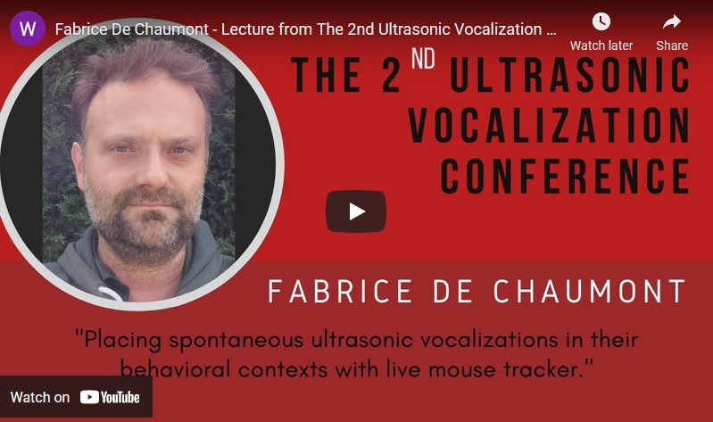

# LMT-USV-Toolbox
Live Mouse Tracker Ultrasonic Vocalization Toolbox

published in TODO

# package needed

- pip install librosa

# synchronisation pipeline

Importation and synchronisation of wav files with LMT are performed by the package LMT.USV.importer

# useful links

- test your own .wav files online without any install at https://usv.pasteur.cloud
- download standalone version of the USV detection program at https://livemousetracker.org, ultrasonic section
- live mouse tracker's documentation : https://livemousetracker.org

# Converting sampling rate of wav files to 300kHz

- Files should be at 300kHz to perform detection in it. You can convert you files using the LMT.USV.convert.convertTo300kHz.py script. Existing file is kept, a new file with .converted.wav extension is created

# List of scripts used to create figures of the Frontiers article.

Figures' scripts are in the package LMT.USV.figure

## Main figures

- Figure 2: [3] Figure2_behavioral_profile_pairs.py
- Figure 3: [2] FigureUsageUSVBurstShortVersion.py
- Figure 4: AcousticAnalysesPerContextStatsBoxplots5we3mo7mo.py
- Figure 5: [pfig] AcousticAnalysesPerContext.py
- Figure 6: [pp] Compute_Speed_Duration_Events_With_Usv.py
- Figure 7: [3] FigureUsageUsvBurstShortVersion.py

## Supplementary figures:

- S1. [1] in Figure2_behavioral_profile_pairs.py
- S2. [1] in Figure2_behavioral_profile_pairs.py
- S3. [2] in Figure2_behavioral_profile_pairs.py
- S4. [2] in Figure2_behavioral_profile_pairs.py
- S5. Codes from Fab, separate fig
- S6. Codes from Fab, separate fig
- S7. [pv] AcousticAnalysesAllUsv.py
- S8. [page] AcousticAnalysesAllUsv.py
- S9. [pko] AcousticAnalysesAllUsv.py
- S10. Separate fig
- S11. Separate fig
- S13. [p] acousticAnalysesPerContext.py
- S14. [page] acousticAnalysesPerContext.py
- S15. [page] acousticAnalysesPerContext.py
- S16. [pko] acousticAnalysesPerContext.py
- S17. [sfig] acousticAnalysesPerContext.py
- S18. [sfig] acousticAnalysesPerContext.py
- S19. [sfig] acousticAnalysesPerContext.py
- S20. [sfig1] acousticAnalysesPerContext.py
- S21. [ppko] Compute_Speed_Duration_Events_With_Usv.py

# Watch a presentation about USV and LMT:

